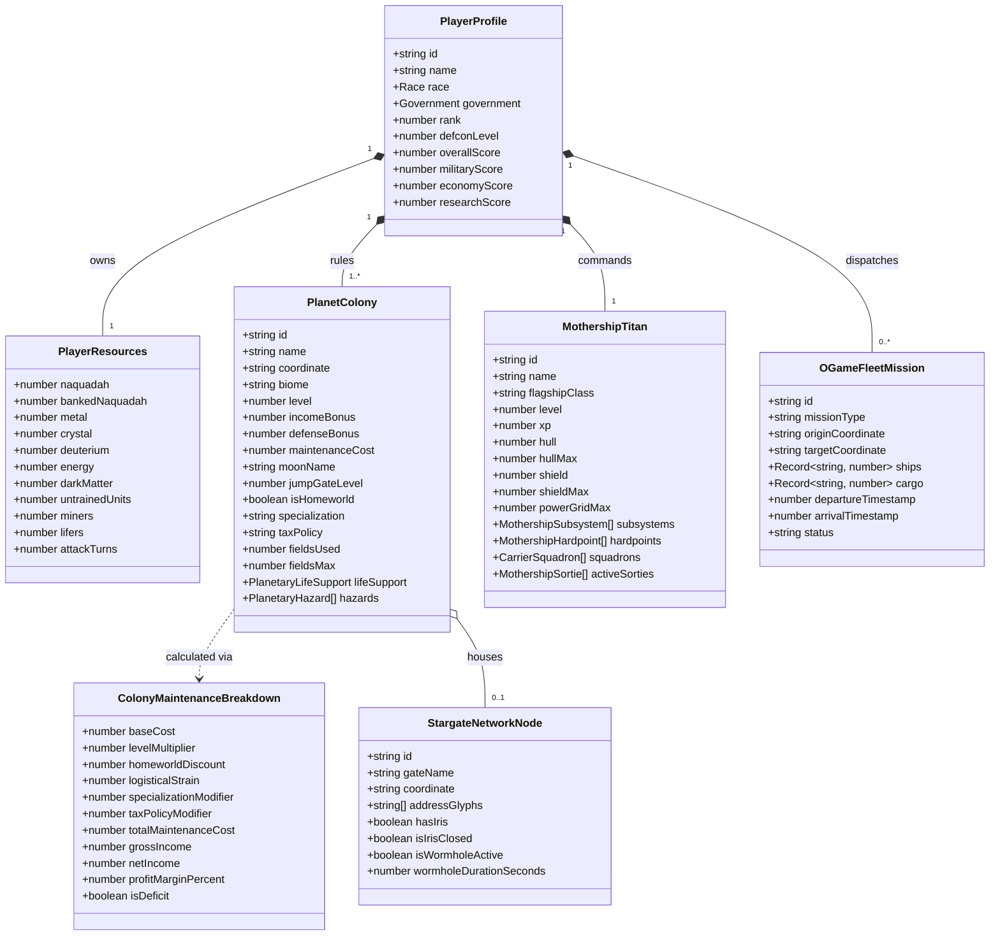
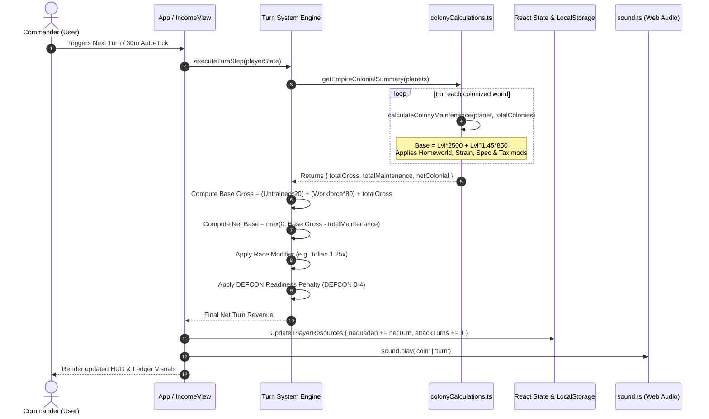
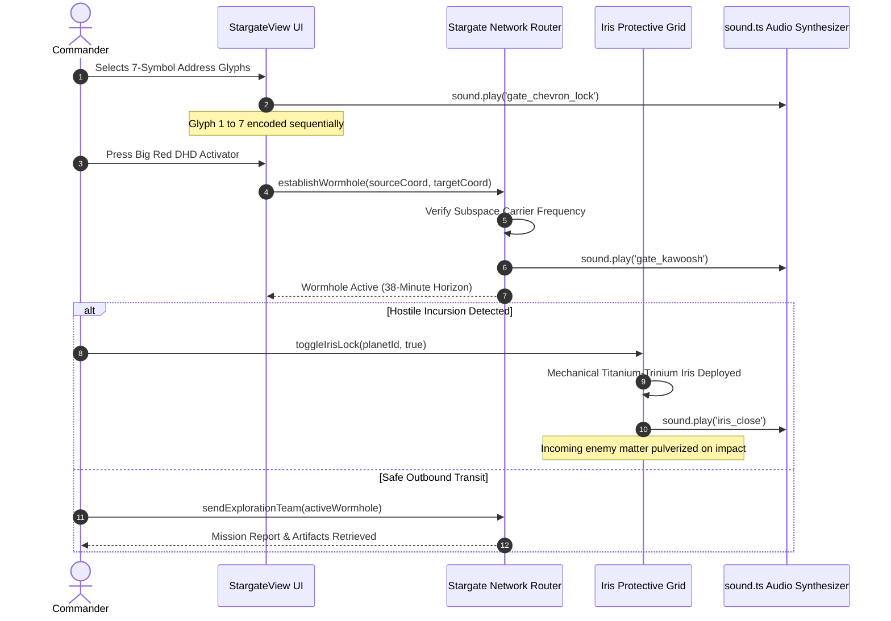
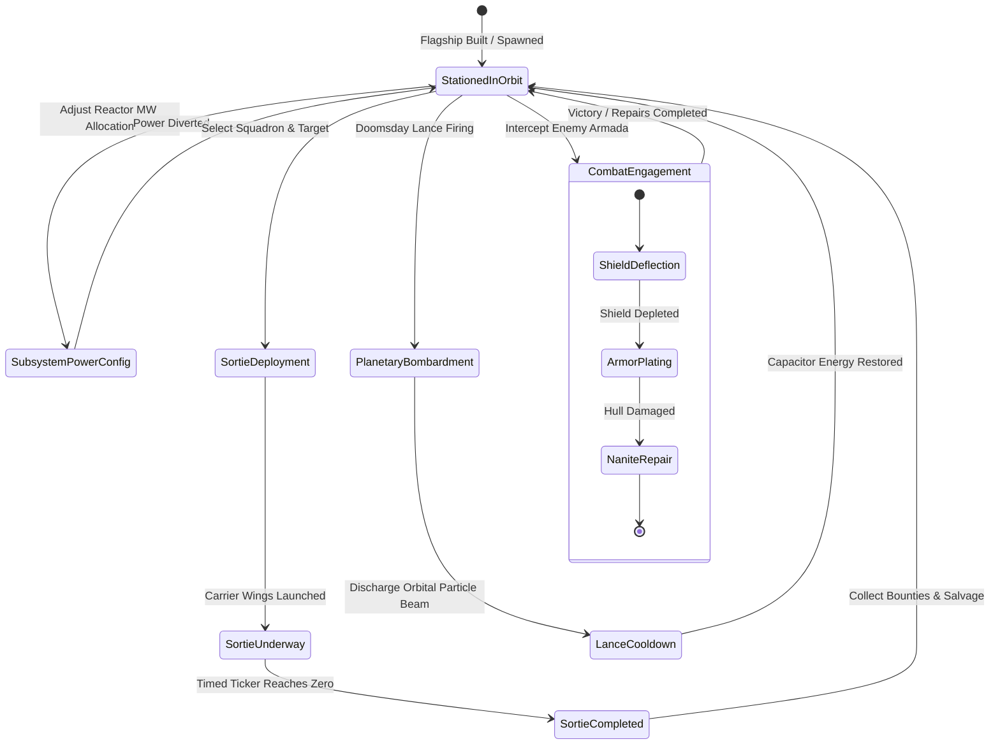

# Universe Civilization: Empire at Wars — Architecture & UML Technical Specification

> **Document Version**: 3.2.0  
> **Target Environment**: React 18+ SPA / TypeScript Strict / Vite / Tailwind CSS  
> **Syntax**: Mermaid UML & Formatted ASCII Class / Sequence Architecture

---

## 1. System Architecture Overview

The application follows a modular, unidirectional state-driven architecture centered around React hooks, persistent local storage caches, an audio synthesis bus, and automated background execution crons.

```mermaid
graph TD
    subgraph UI Layer [React Presentation Components]
        App[App.tsx - Master Orchestrator]
        TopBar[Topbar.tsx - Global Status & Resources]
        NavBar[Navigation Bar & Route Switcher]
        
        DashboardView[DashboardView.tsx]
        PlanetsView[PlanetsView.tsx]
        IncomeView[IncomeView.tsx]
        MothershipView[MothershipView.tsx]
        StargateView[StargateView.tsx]
        UniverseView[UniverseView.tsx]
        CombatView[CombatView.tsx]
        TechTreeView[TechTreeView.tsx]
        ArmoryView[ArmoryView.tsx]
        CronCliView[CronCliView.tsx]
    end

    subgraph Business Logic & Engines [Core Services & Calculations]
        ColonyCalc[colonyCalculations.ts - Maintenance & Expansion]
        TurnEngine[Turn System & Natural Income Engine]
        CombatEngine[Tactical Combat & Fleet Simulator]
        StargateEngine[DHD Dialing & Subspace Wormhole Router]
        CronEngine[cronScheduler.ts - Background Daemon]
        SoundBus[sound.ts - Web Audio API Synthesizer]
    end

    subgraph Data & State Model [Types, Schemas & Persistence]
        StateTypes[types.ts - 1500+ Line Unified Domain Model]
        GameData[gameData.ts - Static Matrices, Units & Specs]
        CronData[cronData.ts - Crontab Rules & Action Registry]
        LocalStorage[(Browser LocalStorage Persistence)]
    end

    App --> TopBar
    App --> NavBar
    App --> DashboardView
    App --> PlanetsView
    App --> IncomeView
    App --> MothershipView
    App --> StargateView
    App --> UniverseView
    App --> CombatView
    App --> TechTreeView
    App --> ArmoryView
    App --> CronCliView

    PlanetsView --> ColonyCalc
    IncomeView --> ColonyCalc
    App --> TurnEngine
    App --> CronEngine
    App --> SoundBus
    
    ColonyCalc --> StateTypes
    TurnEngine --> GameData
    CronEngine --> CronData
    App --> LocalStorage
```



---

## 2. Domain Class & Entity Diagram (UML)



---

## 3. Sequence Diagram: Turn Calculation & Colony Maintenance Upkeep



---

## 4. Sequence Diagram: Stargate DHD Dialing & Iris Engagement



---

## 5. State Transition Diagram: Flagship Combat Operations



---

## 6. Component Hierarchy & Data Flow Diagram

```
[index.html]
    │
    ▼
[main.tsx]
    │
    ▼
[App.tsx] ◄── [sound.ts Audio Engine]
    ├── [Topbar.tsx] (Global Resources, Level, Turn Progress, Cron Activity)
    ├── [Sidebar / Navigation Menu] (20+ Command Views)
    │
    ├── [Views Layer]
    │     ├── [DashboardView.tsx] ──────► [colonyCalculations.ts]
    │     ├── [IncomeView.tsx] ─────────► [colonyCalculations.ts]
    │     ├── [PlanetsView.tsx] ────────► [colonyCalculations.ts]
    │     ├── [MothershipView.tsx] ─────► [gameData.ts]
    │     ├── [StargateView.tsx] ───────► [gameData.ts]
    │     ├── [UniverseView.tsx] ───────► [gameData.ts]
    │     ├── [TechTreeView.tsx] ───────► [gameData.ts]
    │     ├── [ArmoryView.tsx] ─────────► [gameData.ts]
    │     ├── [CombatView.tsx] ─────────► [gameData.ts]
    │     └── [CronCliView.tsx] ────────► [cronScheduler.ts]
    │
    └── [Persistence Layer] (LocalStorage: uc_profile, uc_resources, uc_planets, uc_crontab)
```

---

## 7. Mathematical Model Formalization

### 7.1 Multi-World Logistical Strain Function
Let $N$ be the total count of colonized worlds. The logistical strain multiplier $S(N)$ is defined as:

$$S(N) = \begin{cases} 
1.0 & \text{if } N \le 2 \\
1.0 + (N - 2) \times 0.08 & \text{if } N > 2 
\end{cases}$$

### 7.2 Colony Upgrade Cost Function
For a colony of current tier $L$, the Naquadah cost $C(L)$ to expand to tier $L+1$ is given by:

$$C(L) = L \times 35{,}000 + 20{,}000$$

### 7.3 Expansion Profitability Derivative
The incremental net profit per turn $\Delta P(L)$ upon upgrading a colony tier is:

$$\Delta P(L) = 6{,}500 - \Big(\text{Maintenance}(L+1) - \text{Maintenance}(L)\Big)$$

Where $\Delta P(L) > 0$ indicates a sustainable expansion step, while $\Delta P(L) \le 0$ indicates over-extension requiring immediate workforce or specialization mitigation.
