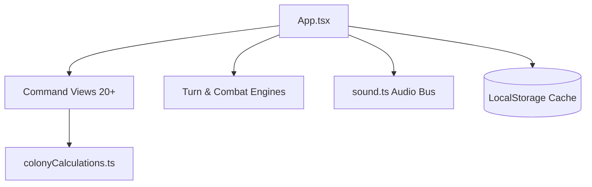

# UML Diagrams & Architecture Reference — Universe Civilization

*See master root document [ARCHITECTURE_UML.md](/ARCHITECTURE_UML.md) for full detailed diagram collection.*

## 1. System Component Overview


## 2. Colony Maintenance Flow
```mermaid
flowchart TD
    Start([Turn Trigger]) --> GetColonies[Scan Player Colonies]
    GetColonies --> CalcBase[Base Cost = Level * 2500 + Level^1.45 * 850]
    CalcBase --> ApplyHomeworld{Is Homeworld?}
    ApplyHomeworld -- Yes --> Discount[-25% Cost]
    ApplyHomeworld -- No --> FullCost[100% Cost]
    Discount --> LogisticalStrain[Multiply by 1.0 + (Worlds - 2) * 0.08]
    FullCost --> LogisticalStrain
    LogisticalStrain --> ApplyDirectives[Apply Spec & Tax Modifiers]
    ApplyDirectives --> DeductFromIncome[Deduct Upkeep from Gross Turn Tribute]
    DeductFromIncome --> End([Final Net Turn Income])
```
